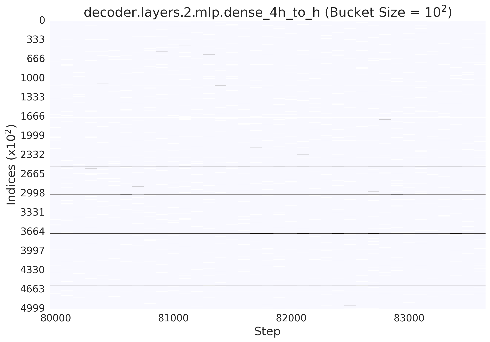

# Radius: a Top-K spasificatin algorithm for pre-training LLMs 

Radius leverages the fact that the gradient values exbit temporal stability during the pre-training, as shown in the image below:



This project is now being developed based on Megatron-LM.

## How to run pre-training
We have provided the slurm scripts for pre-training GPT-355M and GPT-2.0B models using different dense allreduce and Radius [here](./slurm_scrips/perlmutter_scripts/).

Here is an example
```
#!/bin/bash
#SBATCH --account ACCOUNT
#SBATCH --qos regular
#SBATCH --nodes 1
#SBATCH --constraint gpu
#SBATCH --gpus 4 # every perlmutter node has 4 A100 40GB
#SBATCH --time=00:10:00
#SBATCH --ntasks-per-node=4
#SBATCH --gpus-per-task=1
#SBATCH -c 32 # https://docs.nersc.gov/systems/perlmutter/running-jobs/
#SBATCH --output rtx-%J.out
#SBATCH --error  rtx-%J.out
#SBATCH --mail-user=YOUR_EMAIL_ADDRESS
#SBATCH --mail-type=all
#SBATCH --constraint=gpu&hbm80g

# activate virtual env
ml darshan
ml pytorch/1.13.1 

echo "SLURM_NNODES=${SLURM_NNODES}"
echo "SLURM_JOB_NODELIST=${SLURM_JOB_NODELIST}"
echo "SLURM_NTASKS_PER_NODE=${SLURM_NTASKS_PER_NODE}"

GPUS_PER_NODE=$SLURM_NTASKS_PER_NODE
NNODES=$SLURM_NNODES

export GPUS_PER_NODE=$GPUS_PER_NODE
export MASTER_PORT=1234
export WORLD_SIZE=$(($SLURM_NNODES * $SLURM_NTASKS_PER_NODE))
master_addr=$(scontrol show hostnames "$SLURM_JOB_NODELIST" | head -n 1)
export MASTER_ADDR=$master_addr

echo "WORLD_SIZE="$WORLD_SIZE
echo "MASTER_ADDR="$MASTER_ADDR

# Change for multinode config
TENSOR_PARALLEL=1
PIPELINE_PARALLEL=1
DATA_PARALLEL=$(($WORLD_SIZE/$PIPELINE_PARALLEL/$TENSOR_PARALLEL))

global_batch_size=512
echo "global_batch_size=${global_batch_size}"


density=0.9
stable_topk_range=0
stable_topk_threshold=100
stable_topk_interval=200
stable_topk_warmup_method="Dense"


lr=0.00015
min_lr=1.0e-6

reducer="StableTopKReducerWithRangeBucketsEFCorrectionResIsGrad"
experiment_name="GPT2_2.0B_reducer_${reducer}_no_set_nontopk_momemtum_zero_stable"


DATA_PATH=<Specify path and file prefix>_text_document
CHECKPOINT_PATH_LOAD=/path/to/where/baseline/checkpoints/are/stored
start_from=$(cat $CHECKPOINT_PATH_LOAD/latest_checkpointed_iteration.txt)
dir="$reducer/$experiment_name/TP${TENSOR_PARALLEL}_PP${PIPELINE_PARALLEL}_lr_${lr}_min_lr_${min_lr}_density_${density}_range_${stable_topk_range}_update_interval_${stable_topk_interval}_warmup_method_${stable_topk_warmup_method}_warmup_threshold_${stable_topk_threshold}/start_from_$start_from"
CHECKPOINT_PATH_SAVE=/path/to/where/checkpoints/will/be/saved

if [ -e $CHECKPOINT_PATH_SAVE/latest_checkpointed_iteration.txt ] 
then
       CHECKPOINT_PATH_LOAD=$CHECKPOINT_PATH_SAVE
       echo "> Detected checkpoints trained using ${reducer} at path ${CHECKPOINT_PATH_SAVE}"
else 
       echo "> No checkpoint trained using ${reducer} was found."
       echo "> Will start training with ${reducer} and resume from ${start_from}"
fi


output_dir=/path/to/the/generated/logs
mkdir -p  $output_dir

timestamp=$(date +%s)
log_txt_file=$output_dir/loss_ppl_log_${timestamp}.txt

srun -n $WORLD_SIZE -N $NNODES python pretrain_gpt.py \
       --tensor-model-parallel-size $TENSOR_PARALLEL \
       --pipeline-model-parallel-size $PIPELINE_PARALLEL \
       --num-layers 24 \
       --hidden-size 2560 \
       --num-attention-heads 32 \
       --micro-batch-size 8 \
       --global-batch-size $global_batch_size \
       --seq-length 1024 \
       --max-position-embeddings 1024 \
       --train-iters 300000 \
       --lr-decay-iters 192000 \
       --save $CHECKPOINT_PATH_SAVE \
       --load $CHECKPOINT_PATH_LOAD \
       --use-checkpoint-lr-scheduler \
       --data-path $DATA_PATH \
       --vocab-file ./tools/gpt2-vocab.json \
       --merge-file ./tools/gpt2-merges.json \
       --data-impl mmap \
       --split 949,50,1 \
       --distributed-backend nccl \
       --lr $lr \
       --lr-decay-style cosine \
       --min-lr $min_lr \
       --weight-decay 1e-2 \
       --clip-grad 1.0 \
       --lr-warmup-fraction .01 \
       --activations-checkpoint-method uniform \
       --log-interval 1 \
       --save-interval 2000 \
       --eval-interval 100 \
       --eval-iters 10 \
       --experiment_name $experiment_name \
       --accumulate-allreduce-grads-in-fp32 \
       --bf16 \
       --log_txt_file $log_txt_file \
       --grad_comp \
       --grad_comp_type $reducer \
       --density $density \
       --stable_topk_interval $stable_topk_interval \
       --stable_topk_threshold $stable_topk_threshold \
       --stable_topk_warmup_method $stable_topk_warmup_method \
       --stable_topk_range $stable_topk_range \
       --move_grad_clip_to_reducer \
       |& tee $output_dir/log_${timestamp}.txt
       
set +x
```
Please note that you need to define `DATA_PATH`, `CHECKPOINT_PATH_LOAD`, and `CHECKPOINT_PATH_SAVE` in the scripts above, before submitting it.

### DATA_PATH
`DATA_PATH` is the path to where the processed `OpenWebText` data is stored. To generate processed `OpenWebText`, follow the steps below:

1. Run [`download_openwebtxt.py`](./openwebtext/download_openwebtxt.py) to download the `OpenWebText` dataset from [HuggingFace](https://huggingface.co/datasets/Skylion007/openwebtext).

2. Run [`run_preprocess_data.sh`](./tools/run_preprocess_data.sh) which uses [`preprocess_data.py`](./tools/preprocess_data.py) to generate indexed dataset.

### CHECKPOINT_PATH_LOAD
This is the path to the model checkpoints trained by using dense $allreduce$. If you want to switch from dense $allreduce$ to Radius at step=80,000, you will then set `CHECKPOINT_PATH_LOAD` to the corresponding path to the model checkpoints.

### CHECKPOINT_PATH_SAVE
This defines where the Radius checkpoints are saved to. If there are checkpoints in `CHECKPOINT_PATH_SAVE`, it will resume pre-training using the latest checkpoint in that path.

## How to plot curves in paper
Check the exmaples we prepared [here](./plot_loss_curves/logs/).

## How to run evaluation
1. Convert Megatron-LM checkpoint to HF format (Check the code [here](https://github.com/huggingface/transformers/blob/main/src/transformers/models/megatron_gpt2/convert_megatron_gpt2_checkpoint.py)). We prepared examples [here](./eval_model/lm-harness/2.0B/convert_megatron_lm_to_hf/baseline.sh).
2. Use `lm-evaluation-harness` to evaluate the converted checkpoints ([example](./eval_model/lm-harness/2.0B/baseline.sh))